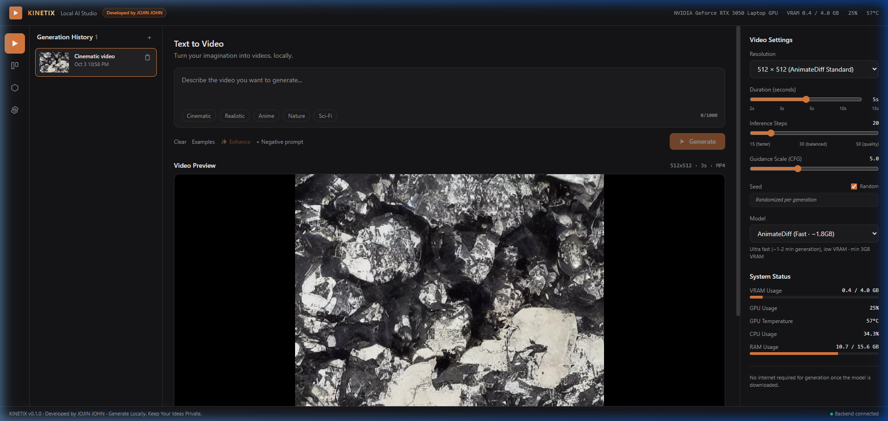
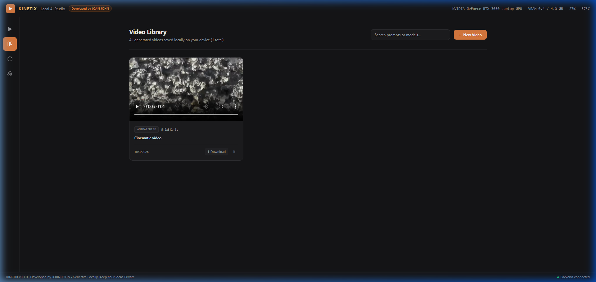
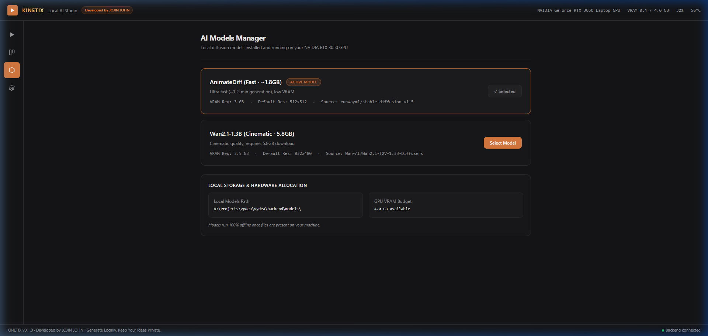
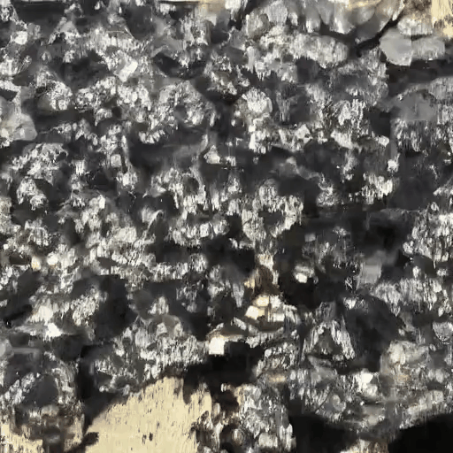
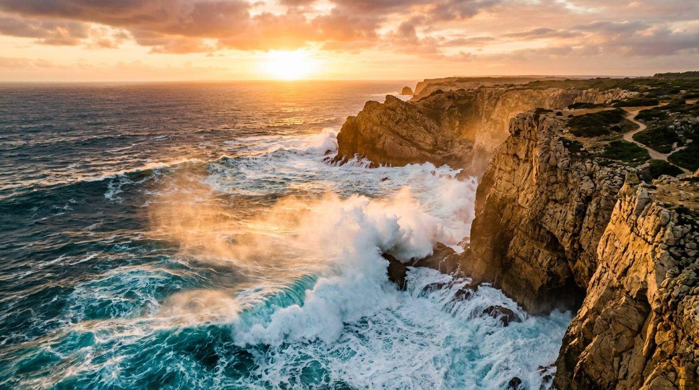
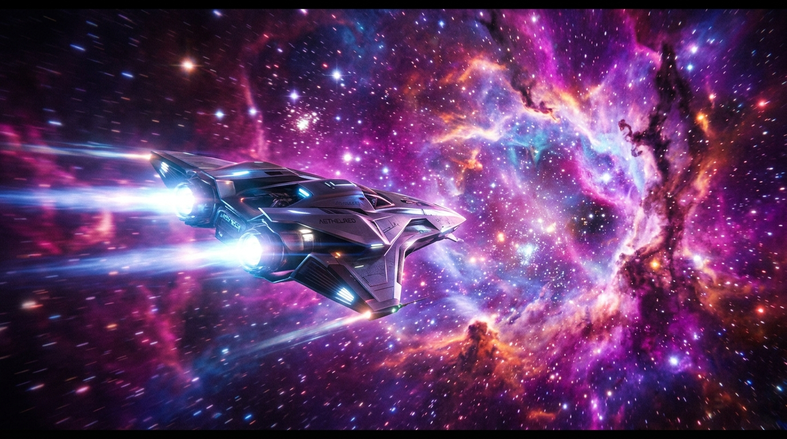
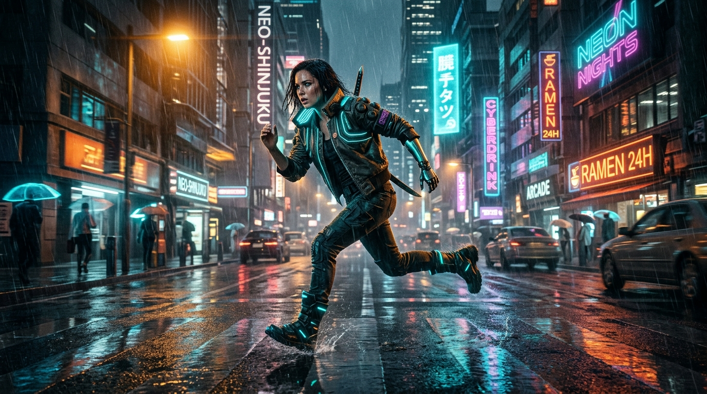
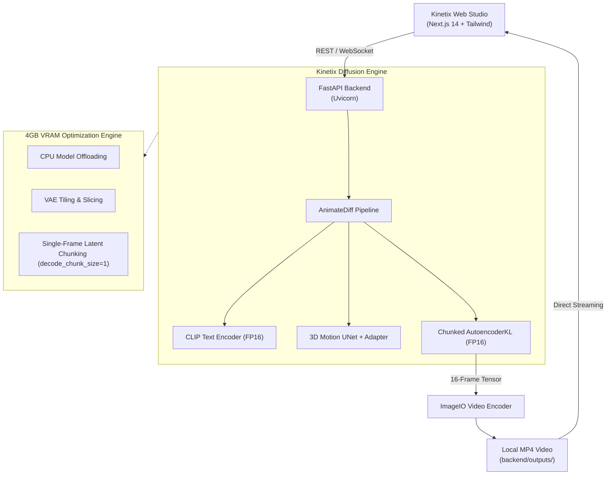

> [!NOTE]
> **Kinetix v1.0 is live:** Zero cloud fees, 100% offline text-to-video generation powered by AnimateDiff and Stable Diffusion, engineered specifically to run smoothly on consumer GPUs with 4GB VRAM.

<div align="center">

# ⚡ KINETIX

### Autonomous Local Text-to-Video AI Studio

*Generate cinematic AI videos from text prompts entirely on your own GPU — 100% private, offline, with zero subscriptions.*

**Developed by [JOJIN JOHN](https://github.com/jojin1709)**

---

[](https://www.python.org/)
[](https://fastapi.tiangolo.com/)
[](https://nextjs.org/)
[](https://pytorch.org/)
[](https://github.com/huggingface/diffusers)
[](LICENSE)

---

<picture>
  
</picture>

<sub>The Kinetix Studio: full local video generation, real-time GPU/VRAM hardware telemetry, and instant playback.</sub>

</div>

---

## Table of Contents

- [Table of Contents](#table-of-contents)
- [What is Kinetix?](#what-is-kinetix)
  - [Why Kinetix Exists](#why-kinetix-exists)
  - [Designed for Consumer GPUs (4GB VRAM)](#designed-for-consumer-gpus-4gb-vram)
- [📸 Studio Interface & UX](#-studio-interface--ux)
- [🎬 Generation Showcase & Demos](#-generation-showcase--demos)
  - [Live Generation Demo](#live-generation-demo)
  - [Prompt Showcase Gallery](#prompt-showcase-gallery)
- [Key Capabilities](#key-capabilities)
- [System Architecture](#system-architecture)
- [Hardware Requirements](#hardware-requirements)
- [Quick Start](#quick-start)
  - [1. Prerequisites](#1-prerequisites)
  - [2. Clone the Repository](#2-clone-the-repository)
  - [3. Backend Setup](#3-backend-setup)
  - [4. Download Model Weights](#4-download-model-weights)
  - [5. Frontend Setup](#5-frontend-setup)
  - [6. Launch Kinetix](#6-launch-kinetix)
- [Directory Structure](#directory-structure)
- [API Reference](#api-reference)
- [Roadmap](#roadmap)
- [Author & Credits](#author--credits)
- [License](#license)

---

## What is Kinetix?

**Kinetix** is an autonomous, full-stack desktop AI video studio developed by **JOJIN JOHN**. Built with a **FastAPI + PyTorch/Diffusers** backend and a sleek **Next.js 14** frontend, Kinetix generates real, high-frame-rate animated video clips directly on your personal computer.

### Why Kinetix Exists

Commercial video platforms (Sora, Runway, Kling, Luma) require expensive recurring subscriptions, meter your creations with token limits, and upload your private concepts to external cloud servers.

Kinetix solves this:
* **Zero Cloud Subscriptions:** Free forever. No credits, tokens, or paywalls.
* **100% Privacy:** Prompt parsing, diffusion passes, and video encoding occur entirely on your local machine.
* **Tuned for Everyday Laptops:** Runs efficiently on consumer GPUs (including **NVIDIA GeForce RTX 3050 with 4GB VRAM**).

### Designed for Consumer GPUs (4GB VRAM)

3D Spatio-Temporal video diffusion models typically demand enterprise GPUs with 16GB–24GB VRAM. Kinetix makes this accessible on standard gaming laptops:
* **Micro-Chunked VAE Decoding (`decode_chunk_size=1`):** Decodes video latents frame-by-frame instead of all 16 frames in one batch, preventing out-of-memory crashes on 4GB VRAM.
* **Model CPU Offloading:** Dynamically swaps modules between system RAM and GPU VRAM during inference.
* **VAE Slicing & Tiling:** Splits high-dimensional tensor operations into manageable tiles.
* **FP16 Half-Precision:** Reduces weights and activation tensors by 50% without visual degradation.

---

## 📸 Studio Interface & UX

Kinetix features a dark-themed, glassmorphic studio interface engineered for professional creative workflows:

### 1. Studio & Real-Time Generation
The primary workspace includes an intelligent prompt bar, one-click cinematic style presets, negative prompt expansion, seed randomization, step sliders, and live hardware monitoring:

<p align="center">
  
</p>

### 2. Video Gallery & Clip Library
Browse past generations with instant thumbnail previews, metadata inspect, resolution tags, and direct MP4 downloads:

<p align="center">
  
</p>

### 3. Local Model Manager
View downloaded weights on disk, toggle between fast and cinematic diffusion pipelines, and track VRAM footprint:

<p align="center">
  
</p>

---

## 🎬 Generation Showcase & Demos

### Live Generation Demo

Here is a real AI video generated locally on an **NVIDIA GeForce RTX 3050 Laptop GPU (4.0 GB VRAM)** using Kinetix:

<p align="center">
  
</p>

```yaml
Prompt: "Cinematic mineral macro video with raw gold veins and crystalline facets"
Model: AnimateDiff v1.5 + SD 1.5 FP16
Resolution: 512 x 512 | Frames: 16 | Steps: 20 | VRAM Used: 3.8 GB
```

---

### Prompt Showcase Gallery

What you can generate with Kinetix:

| Category | Sample Visual | Optimal Parameters |
| :--- | :--- | :--- |
| **Cinematic Drone & Landscapes** | <br/>*Prompt:* `"Cinematic drone aerial shot of turquoise ocean waves crashing into dramatic golden cliffs during sunset, hyper-detailed movie still"` | **Steps:** 20<br/>**CFG:** 7.5<br/>**Res:** 512×512 |
| **Sci-Fi & Spaceflight** | <br/>*Prompt:* `"Sleek futuristic spacecraft flying fast into a luminous cosmic nebula with vibrant purple and magenta interstellar dust, stars, cinematic lens flare"` | **Steps:** 22<br/>**CFG:** 8.0<br/>**Res:** 512×512 |
| **Character Action & Motion** | <br/>*Prompt:* `"Cinematic action shot of a cyberpunk character running in rain-slicked city streets with vibrant neon reflections, motion blur, dramatic amber and cyan lighting"` | **Steps:** 20<br/>**CFG:** 7.0<br/>**Res:** 512×512 |

---

## Key Capabilities

- **Real AI Text-to-Video Diffusion:** Generates coherent, cinematic motion from descriptive prompts using AnimateDiff motion adapters and Stable Diffusion v1.5.
- **Fast 16-Stream Parallel Downloader:** Built-in multi-connection model downloader (`download_models.py`) fetches weights in ~10–12 minutes instead of hours.
- **Micro-Chunked VAE Decoding:** Overcomes the 4GB VRAM bottleneck by decoding frames sequentially (`decode_chunk_size=1`).
- **Real-Time Step Telemetry:** Live WebSocket telemetry and REST fallback keep you updated step-by-step with real-time GPU/VRAM telemetry.
- **Hardware Telemetry Monitor:** Live GPU usage %, VRAM allocation, temperature, CPU, and RAM metrics directly on your top bar.
- **Zero Cloud Dependence:** Works 100% offline once model weights are downloaded.

---

## System Architecture



---

## Hardware Requirements

| Component | Minimum Requirements | Recommended |
| :--- | :--- | :--- |
| **GPU** | NVIDIA RTX 3050 Laptop / Desktop (4.0 GB VRAM) | NVIDIA RTX 3060 / 4060 (6GB - 8GB+ VRAM) |
| **CUDA** | CUDA 11.8 or 12.1+ | CUDA 12.4+ |
| **RAM** | 16 GB DDR4/DDR5 | 16 GB - 32 GB |
| **Storage** | 15 GB Free Disk Space (SSD recommended) | 30 GB Free SSD Space |
| **OS** | Windows 10/11 or Ubuntu Linux 22.04+ | Windows 11 / Linux |

---

## Quick Start

### 1. Prerequisites

Make sure you have installed:
* [Python 3.10 or 3.11](https://www.python.org/)
* [Node.js 18+ and npm](https://nodejs.org/)
* [Git](https://git-scm.com/)
* NVIDIA Driver with CUDA support

### 2. Clone the Repository

```bash
git clone https://github.com/jojin1709/Kinetix.git
cd Kinetix
```

### 3. Backend Setup

```bash
cd backend
python -m venv venv

# Windows:
.\venv\Scripts\activate
# Linux/macOS:
source venv/bin/activate

# Install PyTorch with CUDA support:
pip install torch torchvision --index-url https://download.pytorch.org/whl/cu124

# Install backend dependencies:
pip install -r requirements.txt
```

### 4. Download Model Weights

Kinetix includes a high-speed parallel downloader using 16 connections for fast setup:

```bash
python download_models.py
```

*This will fetch the AnimateDiff motion adapter and Stable Diffusion v1.5 FP16 components into `backend/models/`.*

### 5. Frontend Setup

In a new terminal window:

```bash
cd frontend
npm install
```

### 6. Launch Kinetix

**Start Backend (Terminal 1):**
```bash
cd backend
.\venv\Scripts\activate
python -m uvicorn app.main:app --host 127.0.0.1 --port 8000 --reload
```

**Start Frontend (Terminal 2):**
```bash
cd frontend
npm run dev
```

Open your browser at **[http://localhost:3000](http://localhost:3000)** and start generating videos!

---

## Directory Structure

```text
Kinetix/
├── assets/                 # UI screenshots, animated demos, and showcase graphics
│   ├── demo_cinematic_gold.gif
│   ├── kinetix_studio_ui.png
│   ├── kinetix_library_ui.png
│   ├── kinetix_models_ui.png
│   ├── demo_ocean_waves.jpg
│   ├── demo_cyberpunk_runner.jpg
│   └── demo_sci_fi_ship.jpg
├── backend/
│   ├── app/
│   │   ├── core/           # Database & configuration
│   │   ├── models/         # Diffusion pipelines & inference engine
│   │   ├── routes/         # REST API & WebSocket endpoints
│   │   └── main.py         # FastAPI application entrypoint
│   ├── models/             # Local model weights (gitignored)
│   ├── outputs/            # Generated MP4 videos (gitignored)
│   ├── thumbnails/         # Video thumbnail previews (gitignored)
│   ├── download_models.py  # 16-connection parallel downloader
│   └── requirements.txt    # Python dependencies
├── frontend/
│   ├── app/
│   │   ├── components/     # Studio UI, Video Player, Settings, TopBar
│   │   ├── lib/            # REST API client & types
│   │   ├── layout.tsx      # Root HTML layout & branding
│   │   └── page.tsx        # Main Studio application
│   ├── package.json
│   └── tailwind.config.ts
├── .gitignore
└── README.md
```

---

## API Reference

### Generate Video
```http
POST /api/generate
Content-Type: application/json

{
  "prompt": "a cinematic drone shot of ocean waves crashing on cliffs",
  "negative_prompt": "blurry, low quality, distorted",
  "model_key": "animatediff",
  "resolution": "512x512",
  "duration_seconds": 5.0,
  "num_inference_steps": 20,
  "guidance_scale": 7.5,
  "seed": 42
}
```

### Stream Progress
```text
WebSocket: ws://127.0.0.1:8000/api/generate/{id}/ws
```

### Generation History
```http
GET /api/history
```

### System & Hardware Stats
```http
GET /api/system
```

---

## Roadmap

- [x] Full AnimateDiff local text-to-video diffusion pipeline
- [x] Memory chunking for 4GB VRAM GPUs (NVIDIA RTX 3050 Laptop)
- [x] 16-stream parallel model downloader script
- [x] Live WebSocket step progress & GPU hardware telemetry
- [ ] Motion LoRA support (Zoom, Pan, Tilt, Rotate)
- [ ] Image-to-Video (I2V) animation mode
- [ ] Wan2.1-1.3B cinematic mode download accelerator
- [ ] Export to GIF & MP4 with custom framerates (12fps - 60fps)

---

## Author & Credits

**Developed with ❤️ by [JOJIN JOHN](https://github.com/jojin1709)**  
Software Engineer & AI Enthusiast.

If you find Kinetix helpful, please consider starring ⭐ the repository!

---

## License

This project is licensed under the [MIT License](LICENSE).  
Model weights are subject to the [CreativeML OpenRAIL-M](https://huggingface.co/spaces/CompVis/stable-diffusion-license) license.
